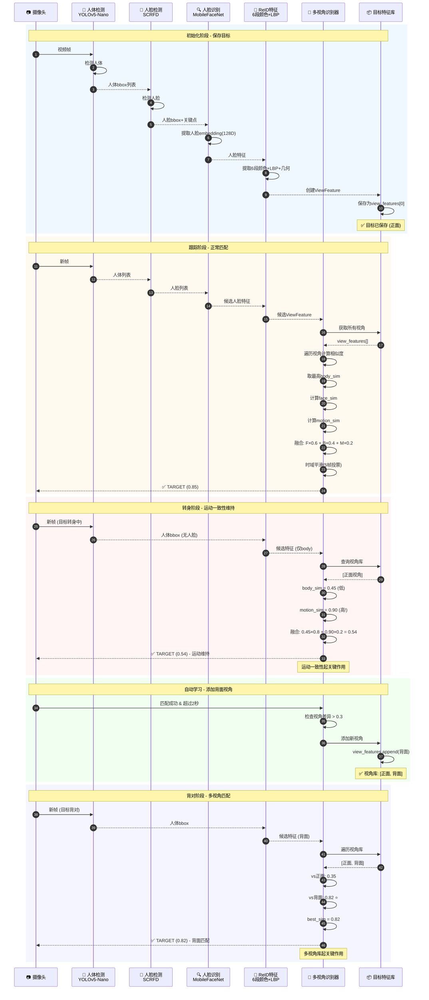
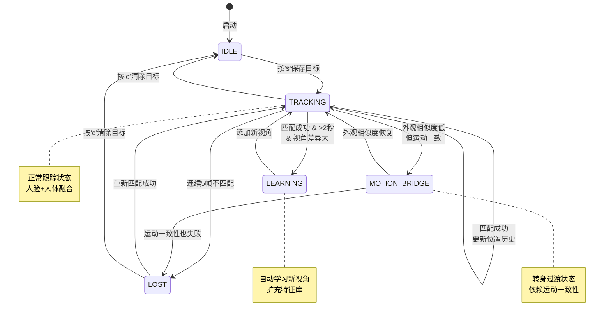
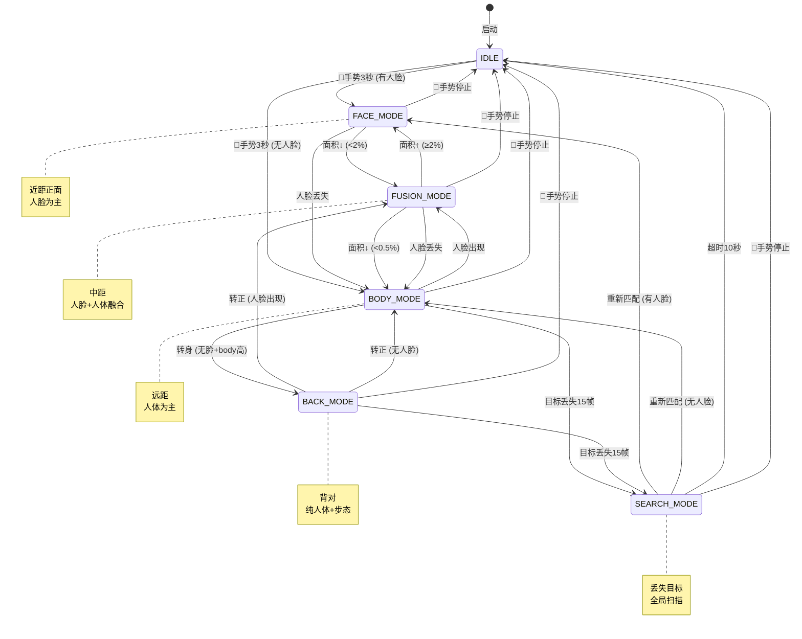
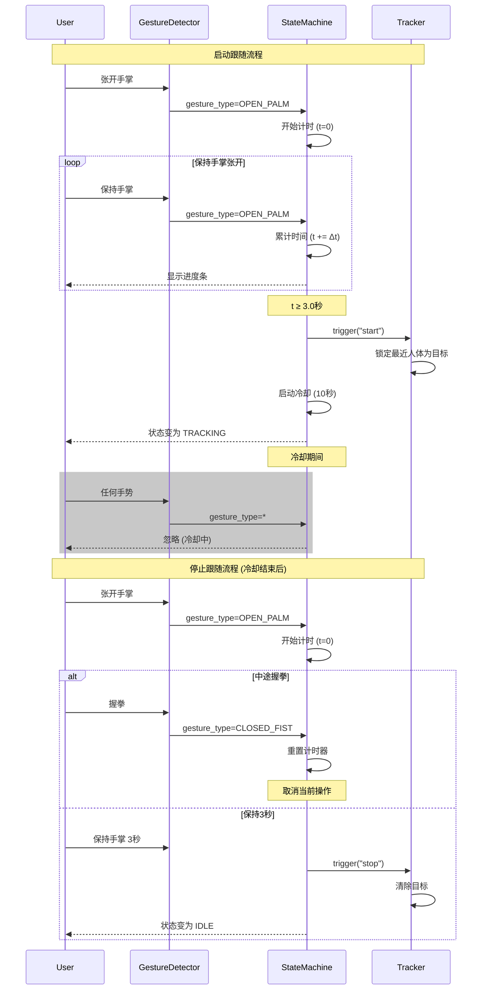
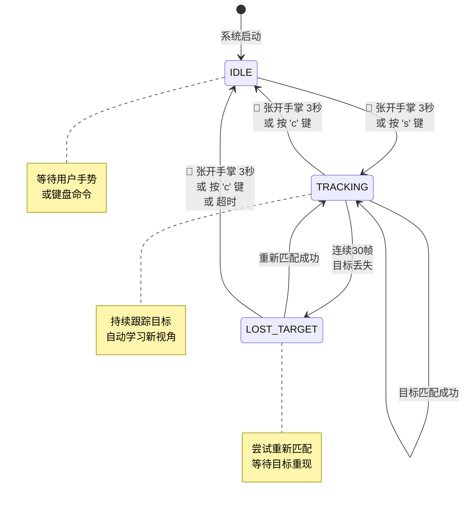

# 多视角目标跟踪系统技术文档

## Multi-View Target Following System

**版本**: v2.0  
**日期**: 2025-12-17  
**适用硬件**: S300 Chip (NPU/DSP/MCU) / PC 预验证环境

---

## 1. 系统概述

### 1.1 设计目标

构建一个鲁棒的单目标跟踪系统，能够在目标转身、遮挡、光照变化等复杂场景下保持稳定跟踪。

### 1.2 核心特性

| 特性          | 描述                                    | 版本 |
| ------------- | --------------------------------------- | ---- |
| 多视角特征库  | 自动积累正面/侧面/背面特征，最多10个视角 | v1.0 |
| 运动一致性    | 速度/方向预测 + 步态周期特征            | v2.0 |
| 人脸+人体融合 | 有人脸时融合识别，无人脸时纯人体特征    | v1.0 |
| 时域平滑      | 多帧投票确认，避免单帧误判闪烁          | v1.0 |
| 自动学习      | 跟踪过程中自动学习新角度                | v1.0 |
| 光照归一化    | CLAHE + 灰度世界白平衡，适应光照变化    | v2.0 |
| 场景感知状态机 | 6状态自动切换 (人脸/融合/人体/背对/搜索) | v2.0 |
| 安全控制层    | PID + 加速度限制 + 二阶滤波             | v2.0 |

### 1.3 场景适配策略 (v2.0 更新)

**场景切换条件**: 使用 **面积比例 + 置信度双条件**，自动适配不同分辨率/焦距摄像头

| 场景状态 | 进入条件 | 检测策略 | 识别策略 | 状态码 |
| -------- | -------- | -------- | -------- | ------ |
| **FACE_MODE** | 面积≥2% & 置信度≥0.7 | 人脸检测为主 | MobileFaceNet 512D | 近距正面 |
| **FUSION_MODE** | 0.5%<面积<2% | 人脸+人体双通路 | 人脸(0.6)+人体(0.4) | 中距 |
| **BODY_MODE** | 面积<0.5% | 人体检测为主 | 分区颜色+LBP+运动 | 远距 |
| **BACK_MODE** | 无人脸 & body_sim≥0.6 | 人体检测 | 多视角匹配+步态 | 背对 |
| **SEARCH_MODE** | 丢失≥15帧 | 全局扫描 | 人脸优先重锁 | 搜索 |

> **面积比例** = bbox面积 / 画面面积，解决了固定像素阈值在不同摄像头下失效的问题

---

## 2. 系统架构

### 2.1 模块组成 (v2.0 更新)

```
┌─────────────────────────────────────────────────────────────────────────────┐
│                    Target Following System v2.0                              │
├─────────────────────────────────────────────────────────────────────────────┤
│                                                                              │
│  ┌──────────────┐  ┌──────────────┐  ┌──────────────┐  ┌──────────────┐    │
│  │ 人体检测器    │  │ 人脸检测器    │  │ 人脸识别器    │  │ 手势检测器    │    │
│  │ YOLOv5-Nano  │  │ SCRFD-500M   │  │ MobileFaceNet│  │ MediaPipe    │    │
│  │ (3.8MB)      │  │ (2.5MB)      │  │ (13MB)       │  │ (需替换)     │    │
│  └──────┬───────┘  └──────┬───────┘  └──────┬───────┘  └──────┬───────┘    │
│         │                 │                 │                 │             │
│         └────────────┬────┴────────────────┴─────────────────┘             │
│                      ▼                                                      │
│  ┌─────────────────────────────────────────────────────────────────────┐   │
│  │              增强版 ReID 特征提取器 (含光照归一化)                     │   │
│  │  - 光照预处理: CLAHE + 灰度世界白平衡 ⭐ v2.0                        │   │
│  │  - 6段分区颜色直方图 (LAB + HSV)                                     │   │
│  │  - LBP 纹理直方图                                                    │   │
│  │  - 几何特征 (宽高比、相对高度)                                        │   │
│  └─────────────────────┬───────────────────────────────────────────────┘   │
│                        ▼                                                    │
│  ┌─────────────────────────────────────────────────────────────────────┐   │
│  │              多视角目标识别器 + 运动状态                              │   │
│  │  - 多视角特征库 (最多10个视角，保护背面) ⭐ v2.0                      │   │
│  │  - 运动一致性: 速度/方向预测 + 步态周期 ⭐ v2.0                       │   │
│  │  - 时域平滑 (5帧投票)                                                │   │
│  │  - 自动学习模块                                                      │   │
│  └─────────────────────┬───────────────────────────────────────────────┘   │
│                        ▼                                                    │
│  ┌─────────────────────────────────────────────────────────────────────┐   │
│  │              场景感知状态机 ⭐ v2.0                                   │   │
│  │  IDLE → FACE_MODE → FUSION_MODE → BODY_MODE → BACK_MODE → SEARCH    │   │
│  │  - 面积比例 + 置信度双条件切换                                        │   │
│  │  - 状态防抖 (最少保持5帧)                                            │   │
│  └─────────────────────┬───────────────────────────────────────────────┘   │
│                        ▼                                                    │
│  ┌─────────────────────────────────────────────────────────────────────┐   │
│  │              安全控制层 ⭐ v2.0                                       │   │
│  │  - PID 控制器 (双轴 pan/tilt)                                        │   │
│  │  - 加速度限制 (max=0.3)                                              │   │
│  │  - 二阶低通滤波 (ω=10, ζ=0.7)                                        │   │
│  │  - 死区处理 (误差<2%不输出)                                          │   │
│  └─────────────────────┬───────────────────────────────────────────────┘   │
│                        ▼                                                    │
│                   控制信号输出 (云台PWM / 机器人轮速)                        │
│                                                                              │
└─────────────────────────────────────────────────────────────────────────────┘
```

### 2.2 数据流

```
摄像头输入 (640×480)
       │
       ▼
┌──────────────────┐
│ 人体检测         │ → 人体边界框列表
│ YOLOv5-Nano      │   [{bbox, conf}, ...]
└────────┬─────────┘
         │
         ▼
┌──────────────────┐
│ 人脸检测         │ → 人脸边界框+关键点
│ SCRFD-500M       │   [{bbox, keypoints, conf}, ...]
└────────┬─────────┘
         │
         ▼
┌──────────────────┐
│ 人脸-人体匹配    │ → 为每个人体分配人脸
│ (中心点包含判断)  │
└────────┬─────────┘
         │
         ▼
┌──────────────────┐
│ 特征提取         │
│ - 人脸: 128D     │ → ViewFeature
│ - 人体: 6段特征   │   {face_embedding, part_hists, ...}
└────────┬─────────┘
         │
         ▼
┌──────────────────┐
│ 多视角匹配       │ → (is_match, similarity, method)
│ - 遍历视角库     │
│ - 运动一致性     │
│ - 时域平滑       │
└────────┬─────────┘
         │
         ▼
    匹配结果
```

### 2.3 时序图



### 2.4 状态转换图



---

## 3. 核心算法

### 3.1 人体特征提取 (6段分区)

```
人体边界框
┌────────────────┐
│    头部 12%    │  ← 权重 0.05 (正反差异大，降低权重)
├────────────────┤
│    肩部 8%     │  ← 权重 0.12
├────────────────┤
│    胸部 15%    │  ← 权重 0.20 (上衣主体)
├────────────────┤
│    腰部 15%    │  ← 权重 0.20 (上衣下摆)
├────────────────┤
│    大腿 25%    │  ← 权重 0.25 (裤子主体)
├────────────────┤
│    小腿 25%    │  ← 权重 0.18
└────────────────┘

每段提取特征:
  1. LAB 颜色直方图 (L:16bins, A:16bins, B:16bins)
  2. HSV 颜色直方图 (H:16bins, S:16bins)
  3. LBP 纹理直方图 (256bins, radius=1, points=8)
  4. 几何特征 (宽高比, 相对高度, 面积比)
```

### 3.2 多视角匹配算法

```python
def compute_similarity(candidate, target):
    # Step 1: 遍历所有已保存视角，取最高相似度
    best_body_sim = 0
    for view in target.view_features:
        sim = compute_body_similarity(view, candidate)
        best_body_sim = max(best_body_sim, sim)
    
    # Step 2: 人脸相似度 (如果双方都有人脸)
    face_sim = None
    if candidate.has_face and target.has_face_view:
        face_sim = compute_face_similarity(candidate, target)
    
    # Step 3: 运动一致性
    motion_sim = compute_motion_consistency(candidate.bbox, target.position_history)
    
    # Step 4: 融合
    if face_sim is not None and face_sim > 0.3:
        # 有人脸参与
        similarity = face_sim * 0.6 + best_body_sim * 0.4 + motion_sim * 0.2
    else:
        # 纯人体 + 运动
        similarity = best_body_sim * 0.8 + motion_sim * 0.2
    
    return min(1.0, similarity)
```

### 3.3 运动一致性计算

```python
def compute_motion_consistency(candidate_bbox, position_history):
    """
    基于位置历史预测目标位置，计算候选与预测的偏差
    """
    # 获取最近0.5秒的位置
    recent = filter(position_history, time_window=0.5)
    
    if len(recent) >= 2:
        # 线性外推预测
        (x1, y1, t1), (x2, y2, t2) = recent[-2], recent[-1]
        vx, vy = (x2-x1)/(t2-t1), (y2-y1)/(t2-t1)
        
        pred_x = x2 + vx * (current_time - t2)
        pred_y = y2 + vy * (current_time - t2)
        
        distance = sqrt((cx - pred_x)² + (cy - pred_y)²)
        return max(0, 1 - distance / max_distance)  # max_distance=150px
    
    return 0.5  # 无历史时返回中等分数
```

### 3.4 时域平滑 (多帧投票)

```python
def temporal_smoothing(is_match, match_history):
    """
    5帧投票，3帧确认
    """
    match_history.append(1 if is_match else 0)
    
    if len(match_history) >= 5:
        vote_count = sum(match_history[-5:])
        return vote_count >= 3  # 至少3帧匹配才确认
    
    return is_match
```

### 3.5 自动学习机制

```python
def auto_learn(candidate, is_match, target):
    """
    跟踪成功时自动学习新视角
    """
    if not is_match:
        return False
    
    # 时间间隔检查 (至少2秒)
    if time.time() - last_learn_time < 2.0:
        return False
    
    # 检查是否为新角度 (与所有已有视角相似度 < 0.7)
    for existing_view in target.view_features:
        if compute_similarity(candidate, existing_view) > 0.7:
            return False  # 太相似，不需要添加
    
    # 添加新视角
    target.view_features.append(candidate)
    return True
```

### 3.6 光照归一化预处理 ⭐ v2.0

解决 ReID 特征在光照变化下失效的问题：

```python
def normalize_illumination(image):
    """
    光照归一化流程:
    1. 灰度世界白平衡 - 消除色偏
    2. LAB 空间 CLAHE - 自适应对比度增强
    """
    # Step 1: 灰度世界白平衡
    b, g, r = cv2.split(image)
    gray_mean = (np.mean(b) + np.mean(g) + np.mean(r)) / 3
    
    b = np.clip(b * (gray_mean / np.mean(b)), 0, 255)
    g = np.clip(g * (gray_mean / np.mean(g)), 0, 255)
    r = np.clip(r * (gray_mean / np.mean(r)), 0, 255)
    image = cv2.merge([b, g, r]).astype(np.uint8)
    
    # Step 2: LAB 空间 CLAHE
    lab = cv2.cvtColor(image, cv2.COLOR_BGR2LAB)
    l, a, b = cv2.split(lab)
    clahe = cv2.createCLAHE(clipLimit=2.0, tileGridSize=(8, 8))
    l = clahe.apply(l)
    lab = cv2.merge([l, a, b])
    
    return cv2.cvtColor(lab, cv2.COLOR_LAB2BGR)
```

**配置项**:
| 参数 | 默认值 | 说明 |
|------|--------|------|
| `use_illumination_normalization` | True | 启用光照归一化 |
| `clahe_clip_limit` | 2.0 | CLAHE 对比度限制 |
| `clahe_grid_size` | 8 | CLAHE 网格大小 |
| `use_gray_world` | True | 灰度世界白平衡 |

### 3.7 运动状态与步态周期 ⭐ v2.0

增强版运动一致性，包含步态周期估计：

```python
class MotionState:
    """运动状态追踪"""
    
    def update(self, bbox, timestamp):
        # 更新位置和速度
        self.velocity = (new_pos - self.position) / dt
        self.direction = np.arctan2(vy, vx)
        
        # 步态周期估计 (通过 Y 坐标周期性波动)
        self._estimate_gait()
    
    def _estimate_gait(self):
        """通过 Y 坐标的过零点检测估计步态频率"""
        y_coords = [p[1] for p in self.history_positions[-20:]]
        y_detrend = y_coords - np.linspace(y_coords[0], y_coords[-1], len(y_coords))
        
        zero_crossings = np.where(np.diff(np.sign(y_detrend)))[0]
        if len(zero_crossings) >= 2:
            periods = np.diff(zero_crossings)
            self.gait_frequency = 1.0 / (np.mean(periods) * 2 * dt)
    
    def compute_consistency(self, candidate_bbox):
        """计算候选框与运动预测的一致性"""
        predicted = self.position + self.velocity * dt
        dist = np.linalg.norm(candidate_pos - predicted)
        allowed = max(50, np.linalg.norm(self.velocity) * 0.5)
        return max(0, 1 - dist / allowed)
```

### 3.8 场景感知状态机 ⭐ v2.0

完整的 6 状态自动切换：



**切换条件配置**:
```python
SceneSwitchConfig(
    # 面积比例阈值
    face_mode_area_ratio = 0.02,      # ≥2% → 人脸模式
    body_mode_area_ratio = 0.005,     # <0.5% → 人体模式
    
    # 置信度阈值
    face_confidence_threshold = 0.7,
    body_confidence_threshold = 0.5,
    face_similarity_threshold = 0.55,
    body_similarity_threshold = 0.60,
    
    # 防抖
    min_frames_in_state = 5,          # 最少保持5帧
    
    # 搜索模式
    lost_to_search_frames = 15,       # 丢失15帧进入搜索
    search_timeout_seconds = 10.0,    # 搜索超时10秒
)
```

### 3.9 安全控制层 ⭐ v2.0

PID 控制器 + 加速度限制 + 二阶滤波，避免近距场景电机过冲：

```python
class TargetController:
    """目标跟随控制器"""
    
    def compute(self, target_bbox, frame_center):
        # 1. 计算归一化误差 [-1, 1]
        error_x = (target_cx - center_x) / (width / 2)
        error_y = (target_cy - center_y) / (height / 2)
        
        # 2. 死区处理 (误差 < 2% 不输出)
        if abs(error_x) < 0.02: error_x = 0
        if abs(error_y) < 0.02: error_y = 0
        
        # 3. PID 计算
        raw_pan = self.pan_pid.compute(error_x)
        raw_tilt = self.tilt_pid.compute(error_y)
        
        # 4. 加速度限制
        pan = self._limit_acceleration(raw_pan, self.prev_pan, self.velocity_pan)
        tilt = self._limit_acceleration(raw_tilt, self.prev_tilt, self.velocity_tilt)
        
        # 5. 二阶低通滤波
        pan = self.pan_filter.filter(pan)
        tilt = self.tilt_filter.filter(tilt)
        
        return ControlOutput(pan, tilt)
```

**控制器配置**:
| 参数 | 默认值 | 说明 |
|------|--------|------|
| `kp` | 0.5 | PID 比例增益 |
| `ki` | 0.02 | PID 积分增益 |
| `kd` | 0.1 | PID 微分增益 |
| `max_acceleration` | 0.3 | 最大加速度 (单位/帧) |
| `max_velocity` | 0.8 | 最大速度 (单位/帧) |
| `filter_omega` | 10.0 | 二阶滤波自然频率 (rad/s) |
| `filter_zeta` | 0.7 | 二阶滤波阻尼比 (临界阻尼) |
| `deadzone` | 0.02 | 死区阈值 |

---

## 4. 模型规格

### 4.1 检测模型

| 模型        | 用途     | 大小  | 输入         | 输出            | 推理时间 |
| ----------- | -------- | ----- | ------------ | --------------- | -------- |
| YOLOv5-Nano | 人体检测 | 3.8MB | 640×640 FP16 | bbox, conf      | ~26ms    |
| SCRFD-500M  | 人脸检测 | 2.5MB | 640×640 FP32 | bbox, keypoints | ~15ms    |

### 4.2 识别模型

| 模型          | 用途     | 大小  | 输入    | 输出      | 特征维度 |
| ------------- | -------- | ----- | ------- | --------- | -------- |
| MobileFaceNet | 人脸识别 | 4.0MB | 112×112 | embedding | 128D     |

### 4.3 手工特征

| 特征           | 维度         | 计算方式                             |
| -------------- | ------------ | ------------------------------------ |
| 分区颜色 (LAB) | 6×48 = 288   | 16+16+16 bins per part               |
| 分区颜色 (HSV) | 6×32 = 192   | 16+16 bins per part                  |
| LBP 纹理       | 6×256 = 1536 | 256 bins per part                    |
| 几何特征       | 3            | aspect_ratio, rel_height, area_ratio |

---

## 5. 配置参数

### 5.1 识别器配置

```python
MultiViewConfig(
    # 特征权重
    face_weight = 0.6,          # 人脸识别权重
    body_weight = 0.4,          # 人体特征权重
    
    # 阈值
    face_threshold = 0.45,      # 人脸匹配阈值
    body_threshold = 0.45,      # 人体匹配阈值 (多视角可降低)
    fused_threshold = 0.45,     # 融合匹配阈值
    
    # 运动一致性
    motion_weight = 0.20,       # 运动一致性权重
    max_motion_distance = 150,  # 最大位移 (像素)
    motion_time_window = 0.5,   # 时间窗口 (秒)
    
    # 时域平滑
    smooth_window = 5,          # 投票窗口 (帧)
    confirm_threshold = 3,      # 确认阈值 (帧)
    
    # 自动学习
    auto_learn = True,          # 是否开启
    learn_interval = 2.0,       # 学习间隔 (秒)
    
    # 分区权重 (降低头部)
    part_weights = [0.05, 0.12, 0.20, 0.20, 0.25, 0.18]
)
```

### 5.2 ReID 配置

```python
EnhancedReIDConfig(
    num_horizontal_parts = 6,   # 水平分段数
    h_bins = 16,                # 色相 bins
    s_bins = 16,                # 饱和度 bins
    use_lab = True,             # 使用 LAB 色彩空间
    use_lbp = True,             # 使用 LBP 纹理
    lbp_radius = 1,             # LBP 半径
    lbp_points = 8,             # LBP 采样点
    use_geometry = True,        # 使用几何特征
    
    # 融合权重
    color_weight = 0.5,         # 颜色权重
    texture_weight = 0.3,       # 纹理权重
    geometry_weight = 0.2,      # 几何权重
)
```

---

## 6. 使用指南

### 6.1 快速开始

```bash
# 1. 进入项目目录
cd examples/target_following

# 2. 运行多视角跟踪测试
uv run python tests/test_multiview.py
```

### 6.2 操作说明

| 按键      | 功能                        |
| --------- | --------------------------- |
| `s`       | 保存当前人为目标 (初始化)   |
| `a`       | 手动添加当前视角 (转身后按) |
| `c`       | 清除目标                    |
| `m`       | 切换自动学习开关            |
| `+` / `-` | 调整阈值偏移                |
| `q`       | 退出                        |

### 6.3 推荐使用流程

```
1. 目标正对镜头 → 按 's' 保存
2. 目标慢慢转身 → 系统自动维持跟踪 (运动一致性)
3. 目标完全背对 → 
   - 方案A: 等待自动学习 (2秒后自动添加背面视角)
   - 方案B: 按 'a' 手动添加背面视角
4. 目标再次正对 → 自动匹配正面视角
```

---

## 7. 性能指标

### 7.1 PC 测试环境

- **CPU**: Intel Core i7-12700KF
- **GPU**: NVIDIA RTX 3070 Ti
- **分辨率**: 640×480

### 7.2 帧率统计

| 模块       | 耗时      | 备注          |
| ---------- | --------- | ------------- |
| 人体检测   | ~26ms     | YOLOv5-Nano   |
| 人脸检测   | ~15ms     | SCRFD-500M    |
| 人脸识别   | ~8ms      | MobileFaceNet |
| 特征提取   | ~5ms      | 6段颜色+LBP   |
| 多视角匹配 | ~2ms      | 5视角         |
| **总计**   | **~56ms** | **~18 FPS**   |

### 7.3 准确率 (初步测试)

| 场景         | 识别准确率 | 备注              |
| ------------ | ---------- | ----------------- |
| 正面跟踪     | >95%       | 人脸+人体融合     |
| 侧面跟踪     | >85%       | 多视角+运动一致性 |
| 背面跟踪     | >80%       | 需要添加背面视角  |
| 相似衣服区分 | ~70%       | 依赖LBP纹理+人脸  |

---

## 8. 手势控制系统

### 8.1 概述

系统支持通过手势进行无接触控制，使用 MediaPipe Hands 进行手势识别。

### 8.2 手势定义

| 手势                   | 动作             | 说明            |
| ---------------------- | ---------------- | --------------- |
| 👋 张开手掌 (Open Palm) | Toggle 启动/停止 | 需保持 3 秒触发 |
| ✊ 握拳 (Closed Fist)   | 取消当前手势     | 重置计时器      |

### 8.3 配置参数

```python
# 手势配置
GESTURE_HOLD_DURATION = 3.0      # 触发需要保持的秒数
GESTURE_COOLDOWN_SECONDS = 10.0  # 触发后冷却秒数 (防止连续触发)

# 状态机初始化
state_machine = StateMachine(
    lost_timeout_frames=30,        # 目标丢失超时帧数
    gesture_hold_duration=3.0,     # 手势保持时间 (秒)
    gesture_cooldown_seconds=10.0  # 冷却时间 (秒)
)
```

### 8.4 状态机逻辑

```
                    ┌──────────────────────────────────────┐
                    │           GestureDetector            │
                    │         (MediaPipe Hands)            │
                    └────────────────┬─────────────────────┘
                                     │ gesture_type
                                     ▼
                    ┌──────────────────────────────────────┐
                    │           StateMachine               │
                    │                                      │
                    │  ┌─────────────────────────────────┐│
                    │  │ 冷却检查 (cooldown > 0?)         ││
                    │  │  → 是: 忽略所有手势              ││
                    │  └─────────────┬───────────────────┘│
                    │                │ 否                  │
                    │                ▼                     │
                    │  ┌─────────────────────────────────┐│
                    │  │ 手势类型判断                     ││
                    │  │  - NONE: 重置计时器              ││
                    │  │  - 非OPEN_PALM: 重置计时器       ││
                    │  │  - OPEN_PALM: 累计时间           ││
                    │  └─────────────┬───────────────────┘│
                    │                │ OPEN_PALM          │
                    │                ▼                     │
                    │  ┌─────────────────────────────────┐│
                    │  │ 持续时间检查 (≥3秒?)             ││
                    │  │  → 是: 触发 Toggle              ││
                    │  │  → 否: 继续累计                  ││
                    │  └─────────────────────────────────┘│
                    └──────────────────────────────────────┘
```

### 8.5 手势控制时序图



### 8.6 状态转换图 (含手势控制)



---

## 9. 文件结构 (v2.0 更新)

```
examples/target_following/
├── config.py                      # 全局配置
├── main.py                        # 主程序入口
├── README.md                      # 项目说明
│
├── core/                          # 核心模块
│   ├── state_machine.py           # 基础状态机控制器
│   ├── scene_state_machine.py     # 场景感知状态机 ⭐ v2.0
│   ├── controller.py              # PID 安全控制器 ⭐ v2.0
│   └── camera.py                  # 摄像头管理
│
├── detectors/                     # 检测器模块
│   ├── yolov5_person_detector.py  # YOLOv5-Nano 人体检测
│   ├── face_detector.py           # SCRFD 人脸检测
│   ├── mobilefacenet_recognizer.py # MobileFaceNet 人脸识别
│   ├── gesture_detector.py        # MediaPipe 手势检测 (待替换)
│   ├── enhanced_reid.py           # 增强版 ReID (含光照归一化) ⭐ v2.0
│   ├── multiview_recognizer.py    # 多视角目标识别器
│   └── fused_recognizer.py        # 融合识别器
│
├── tests/                         # 测试脚本
│   ├── test_gesture_following.py  # 手势控制跟随测试 ⭐
│   ├── test_multiview.py          # 多视角跟踪测试
│   ├── test_enhanced_fused.py     # 增强融合测试
│   ├── test_yolov5_person.py      # 人体检测测试
│   └── test_face.py               # 人脸识别测试
│
├── models/                        # 模型文件
│   ├── yolov5n.onnx               # 人体检测 (3.8MB)
│   ├── scrfd_500m_bnkps.onnx      # 人脸检测 (2.5MB)
│   └── mobilefacenet.onnx         # 人脸识别 (13MB)
│
└── docs/                          # 文档
    └── MULTIVIEW_TRACKING.md      # 本文档
```

---

## 10. 后续优化方向

### 10.1 已完成 ✅

- [x] 多视角特征库 (最多10个视角)
- [x] 场景感知状态机 (6状态自动切换)
- [x] 光照归一化预处理 (CLAHE + 灰度世界白平衡)
- [x] 增强运动一致性 (步态周期估计)
- [x] 安全控制层 (PID + 加速度限制 + 二阶滤波)

### 10.2 短期优化

- [ ] DeepSORT-lite 集成：添加卡尔曼滤波预测
- [ ] 负样本库：排除相似外观的非目标
- [ ] 多人场景：支持多目标同时跟踪
- [ ] MediaPipe 替换：训练 YOLOv5-Nano 多类别 (Person+Hand_Open+Hand_Fist)

### 10.3 中期优化

- [ ] 轻量 ReID 模型：训练 MobileNetV2-ReID 替代手工特征
- [ ] 关键点跟踪：人脸关键点卡尔曼滤波
- [ ] 遮挡处理：部分遮挡时的特征融合
- [ ] 姿态辅助：利用骨骼关键点辅助跟踪

### 10.4 长期优化 (S300 部署)

- [ ] NPU 量化：全 INT8 量化部署
- [ ] DSP 移植：颜色直方图/LBP 计算迁移到 DSP
- [ ] 模型合并：人体+手势合并为单一模型
- [ ] 功耗优化：动态调整检测频率
- [ ] 云台接口：PWM/串口控制适配

---

## 11. S300 部署关键风险

### 11.1 MediaPipe 无法在 NPU 运行 (Blocker)

**问题**: MediaPipe Hands 包含大量自定义算子，不支持 S300 NPU。

**解决方案**:
| 方案 | 描述 | 工作量 |
|------|------|--------|
| **A (推荐)** | YOLOv5-Nano 多类别训练 (Person+Hand_Open+Hand_Fist) | 中等 |
| B | Nanodet-Hand + 分类头 | 较大 |
| C | 简化为按键触发 (无手势) | 很小 |

### 11.2 ReID 算法计算载体

**问题**: 颜色直方图/LBP 在 MCU 上非常慢。

**解决方案**: 移植到 **DSP (SensPro 250)** 运行，利用向量指令集加速。

### 11.3 模型量化精度

**问题**: MobileFaceNet 需全 INT8 量化，可能损失精度。

**解决方案**: 
- 量化后验证余弦相似度
- 如损失严重，最后一层切分到 DSP 以 FP32 运行

### 11.4 串行推理延迟

**问题**: 4 个模型串行可能导致 FPS < 10。

**解决方案**:
| 策略 | 效果 |
|------|------|
| 隔帧策略 | 人脸每 5 帧检测一次 |
| ROI 优化 | 只在头部区域跑 SCRFD (128×128) |
| 模型合并 | 人体+手势合并为一个模型 |

---

## 12. S300 部署架构

```
┌─────────────────────────────────────────────────────────────────┐
│                        S300 部署流水线                           │
├─────────────────────────────────────────────────────────────────┤
│                                                                  │
│  ┌─────────┐    ┌──────────────────────────────────────────┐    │
│  │ DVP摄像头 │───▶│ DSP: 图像预处理 (缩放/格式转换/归一化)    │    │
│  └─────────┘    └──────────────────┬───────────────────────┘    │
│                                    │                             │
│                                    ▼                             │
│  ┌─────────────────────────────────────────────────────────┐    │
│  │ NPU: YOLOv5 (人体+手势检测，合并模型)                      │    │
│  └──────────────────────────┬──────────────────────────────┘    │
│                              │                                   │
│          ┌───────────────────┼───────────────────┐               │
│          ▼                   ▼                   ▼               │
│  ┌─────────────┐    ┌─────────────┐    ┌─────────────────┐      │
│  │MCU: 逻辑判断 │    │DSP: 裁剪ROI │    │DSP: ReID特征提取│      │
│  │  (隔帧控制) │    │  (头部区域)  │    │ (颜色+LBP+几何) │      │
│  └──────┬──────┘    └──────┬──────┘    └────────┬────────┘      │
│         │                  │                    │                │
│         │                  ▼                    │                │
│         │         ┌─────────────┐               │                │
│         │         │NPU: SCRFD   │               │                │
│         │         │ (ROI人脸检测)│               │                │
│         │         └──────┬──────┘               │                │
│         │                │                      │                │
│         │                ▼                      │                │
│         │        ┌──────────────┐               │                │
│         │        │NPU: MobileFace│               │                │
│         │        │ (人脸识别)    │               │                │
│         │        └──────┬───────┘               │                │
│         │               │                       │                │
│         ▼               ▼                       ▼                │
│  ┌──────────────────────────────────────────────────────────┐   │
│  │ MCU: 场景状态机 + 多视角匹配 + PID控制                     │   │
│  └──────────────────────────────────────────────────────────┘   │
│                              │                                   │
│                              ▼                                   │
│  ┌──────────────────────────────────────────────────────────┐   │
│  │ MCU: 输出控制信号 (云台PWM / 机器人轮速 / 无人机姿态)       │   │
│  └──────────────────────────────────────────────────────────┘   │
│                                                                  │
└─────────────────────────────────────────────────────────────────┘
```

---

## 13. 参考资料

1. YOLOv5: https://github.com/ultralytics/yolov5
2. SCRFD: https://github.com/deepinsight/insightface
3. MobileFaceNet: https://arxiv.org/abs/1804.07573
4. LBP: Local Binary Patterns for texture classification
5. DeepSORT: https://github.com/nwojke/deep_sort
6. MediaPipe Hands: https://developers.google.com/mediapipe/solutions/vision/hand_landmarker
7. CLAHE: https://docs.opencv.org/master/d5/daf/tutorial_py_histogram_equalization.html
8. PID Control: https://en.wikipedia.org/wiki/PID_controller
9. Second-Order Systems: https://lpsa.swarthmore.edu/SecondOrderSystemsDynamics.html

---

## 14. 版本历史

| 版本 | 日期 | 主要更新 |
|------|------|----------|
| v1.0 | 2025-12-16 | 初始版本：多视角特征库、运动一致性、自动学习 |
| v2.0 | 2025-12-17 | 场景感知状态机、光照归一化、步态周期、安全控制层 |

---

**文档维护**: AI Agent  
**最后更新**: 2025-12-17
